<div align="center">
  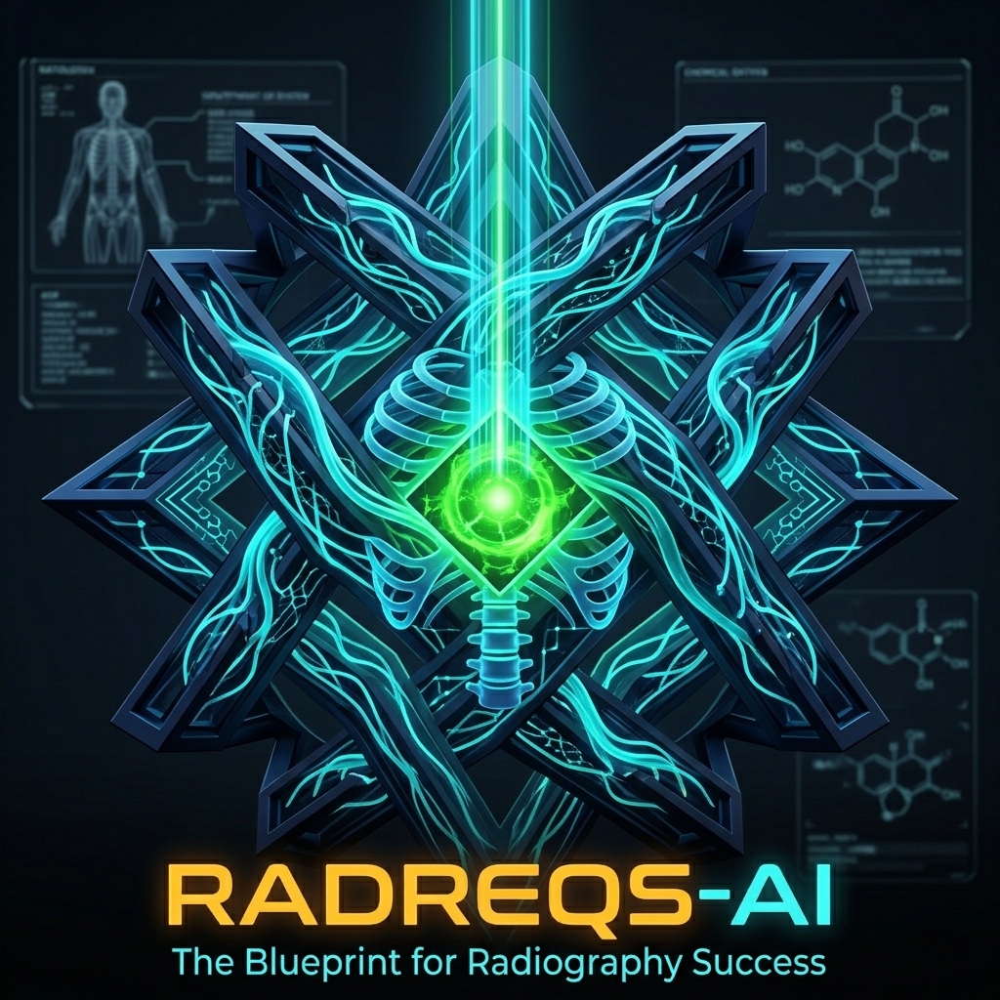
</div>

# RadReqs-AI ☢️

[](https://RorriMaesu.github.io/RadReqs-AI/)
[](#)
[](#)
[](#)
[](#)

<a href="https://buymeacoffee.com/rorrimaesu" target="_blank"></a>

**RadReqs-AI** is a premium, AI-powered educational suite designed specifically for aspiring Radiation Therapists and Radiologic Technologists (X-Ray Techs). It accelerates learning through highly gamified spaced-repetition, intelligent clinical scenario decryption, and an integrated local LLM tutor powered by Google's Gemma 4.

<p align="center">
  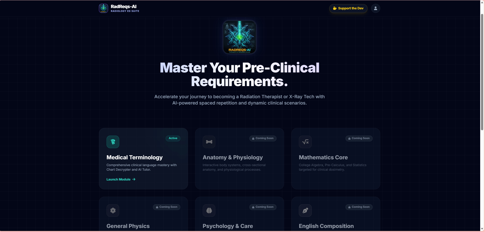
</p>

---

## 🌟 Features

### 1. The RadReqs Hub
A sleek, modern central landing page providing access to the complete prerequisite and core curriculum required for radiology professionals. The entire suite features fully integrated **Light and Dark Mode** options with beautiful, frosted-glass navigation and fluid theme switching.

### 2. Medical Terminology (Active Module)
The foundational module for clinical language mastery.
- **Spaced Repetition Flashcards:** Adaptive algorithm to ensure long-term retention of medical roots, prefixes, and suffixes.
- **Chart Decrypter:** Translates complex clinical SOAP notes into plain English, intelligently graded by an LLM.
- **Abbreviation Decoder & Pluralization:** Rapid-fire tools to master medical shorthand and grammar.
- **Dr. Lex (AI Tutor):** An integrated, warm, and precise AI tutor powered by **Gemma 4** (via Ollama) that can break down complex terms, provide mnemonics, and generate on-demand quizzes.

<table width="100%">
  <tr>
    <td width="50%">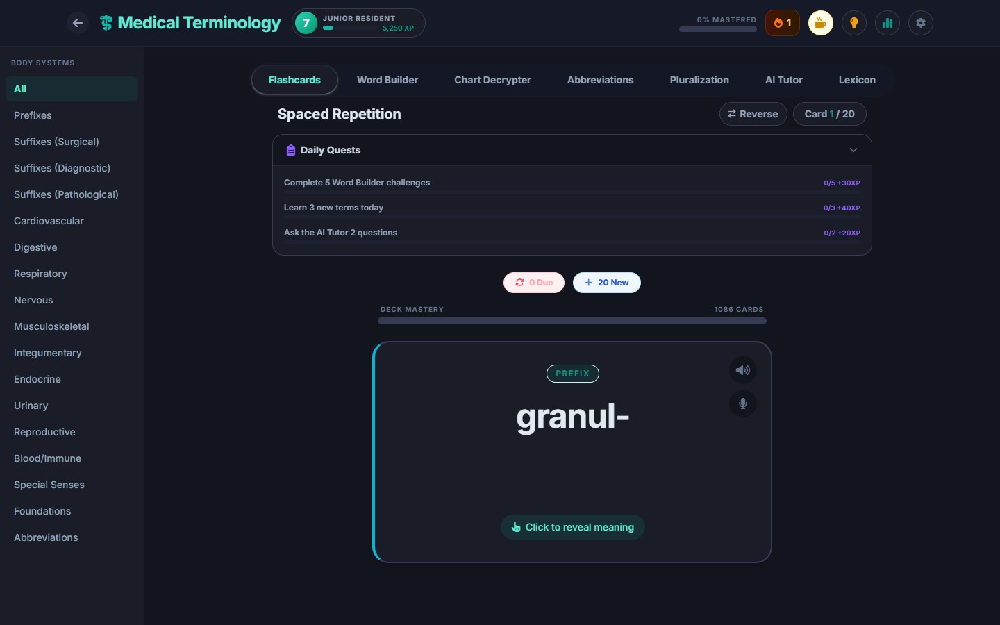</td>
    <td width="50%">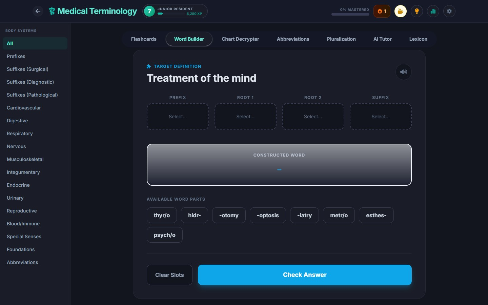</td>
  </tr>
  <tr>
    <td width="50%">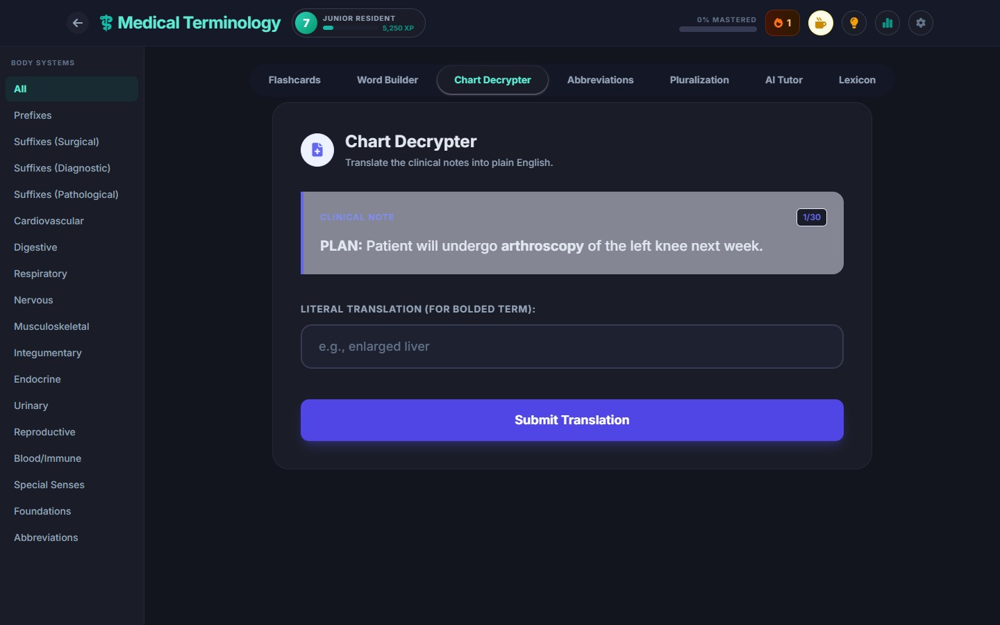</td>
    <td width="50%">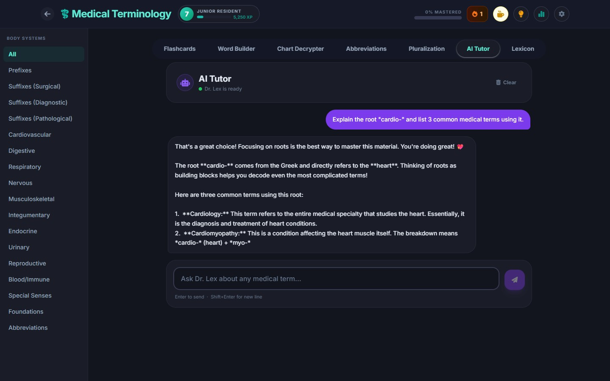</td>
  </tr>
  <tr>
    <td width="50%">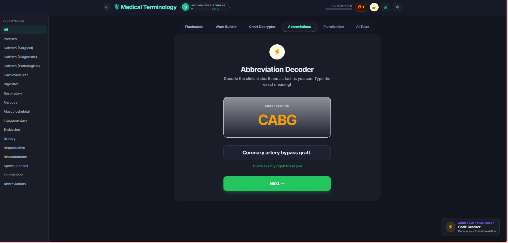</td>
    <td width="50%">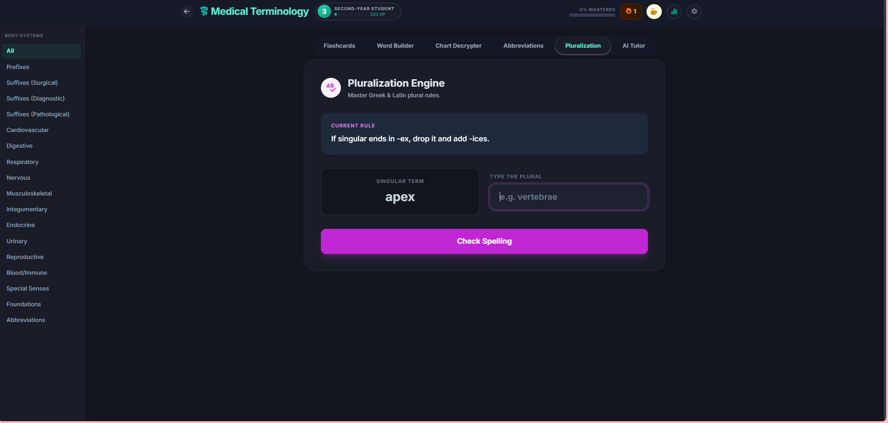</td>
  </tr>
</table>

### 3. Gamification Engine
Learning complex clinical data is hard. RadReqs-AI keeps you engaged and addicted to studying.
- **XP & Leveling System:** Progress from *Pre-Med Student* all the way to *Legacy Master*.
- **Streak Tracking & Shields:** Maintain daily study streaks, unlock comeback achievements, and earn streak shields to protect your progress.
- **Achievement Badges:** Unlock over 20 unique badges like *Hundred Club*, *Code Cracker*, and *Clinical Clarity*.
- **Daily Quests:** Complete procedurally generated daily objectives for bonus XP.

<table width="100%">
  <tr>
    <td width="50%">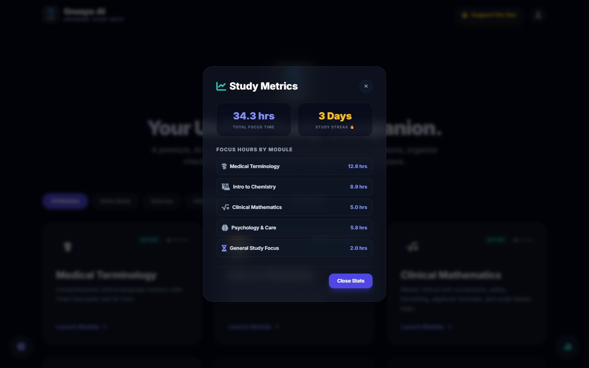</td>
    <td width="50%">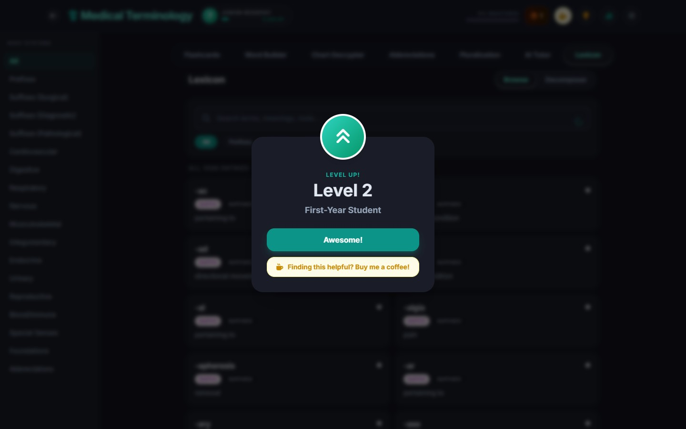</td>
  </tr>
</table>

### 4. Fully Responsive Mobile UI
Study anywhere, perfectly optimized for your phone.

<table width="100%">
  <tr>
    <td width="50%">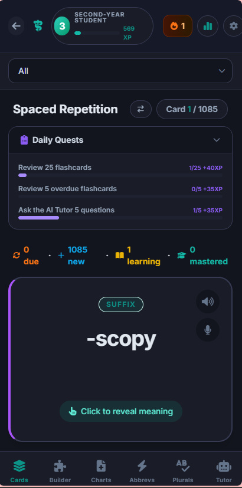</td>
    <td width="50%">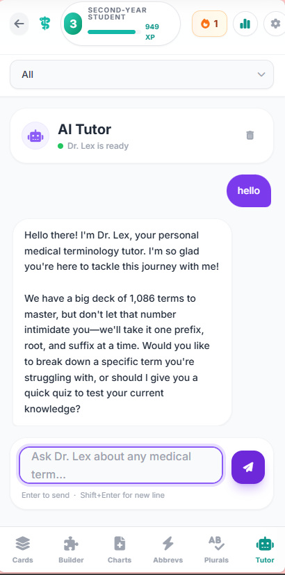</td>
  </tr>
</table>

### 5. Comprehensive Curriculum Roadmap
Placeholders are beautifully integrated for future module expansion, creating a complete pathway:
- Anatomy & Physiology
- General Physics & Mathematics Core
- Radiographic Positioning & Image Production
- Radiation Protection & Radiobiology
- Radiation Physics & Dosimetry
- Treatment Planning
- Oncology & Pathology

---

## 🚀 Getting Started

### Path A: For Students (1-Click Setup)
You do not need to download this repository or know how to code to use RadReqs-AI. The suite is hosted entirely online at **[https://RorriMaesu.github.io/RadReqs-AI/](https://RorriMaesu.github.io/RadReqs-AI/)**.

However, for **Dr. Lex** (the AI Tutor) to work, it runs completely free and privately on your own computer. To activate him:

1. **Install Ollama:** Download and install the Ollama app for [Windows (.exe)](https://ollama.com/download/OllamaSetup.exe) or [macOS (.zip)](https://ollama.com/download/Ollama-darwin.zip).
2. **Download the 1-Click Launchers:** 
   - **[⬇️ Download Dr. Lex Launchers (.zip)](https://github.com/RorriMaesu/RadReqs-AI/raw/main/assets/Dr_Lex_Launchers.zip)**
3. **Run the Script:** Open the downloaded `.zip` file. You will see multiple scripts. Double-click the launcher that matches your computer's power:
   - `1 - 8GB VRAM` (Best for standard laptops / older PCs)
   - `2 - 12GB VRAM` (Best for standard gaming PCs)
   - `3 - 16GB+ VRAM` (Best for high-end workstations & Macs)
   
   - **Windows Users:** If a dialog appears asking to "Extract all" or "Run", simply click **Run**. If Windows SmartScreen displays a blue 'Windows protected your PC' warning, click **More info** and then **Run anyway**.
   - **Mac Users:** You may need to right-click -> Open if you get a permissions warning.

The script will automatically configure browser security permissions (CORS), download Dr. Lex's brain (this takes a few minutes the first time), and instantly launch the website for you to start studying!

---

### Path B: For Developers (Local Development)
RadReqs-AI is built with pure Vanilla JavaScript and HTML.

1. Clone the repository:
   ```bash
   git clone https://github.com/RorriMaesu/RadReqs-AI.git
   cd RadReqs-AI
   ```
2. Start a local HTTP server from the root directory:
   ```bash
   python -m http.server 8000
   ```
3. Open your browser and navigate to `http://localhost:8000`.

*Deployment Note:* The project is configured with a GitHub Actions workflow (`deploy.yml`) that automatically deploys the `main` branch to GitHub Pages.

---

## 🛠️ Architecture
- **Frontend:** HTML5, TailwindCSS (via CDN), Vanilla JavaScript.
- **Data Persistence:** Client-side `localStorage` with a robust zero-data-loss automatic migration system between module versions.
- **AI Integration:** Direct asynchronous `fetch` requests to `http://localhost:11434` (Ollama REST API).
- **Icons:** FontAwesome 6.

---

## ☕ Support the Project
RadReqs-AI is a free, open-source educational suite built to help future healthcare heroes. If this app helped you pass your exams or master clinical language, consider buying me a coffee to support continued development and hosting! 

<a href="https://buymeacoffee.com/rorrimaesu" target="_blank"></a>

---

*Built for Clinical Excellence.*
