<div align="center">
  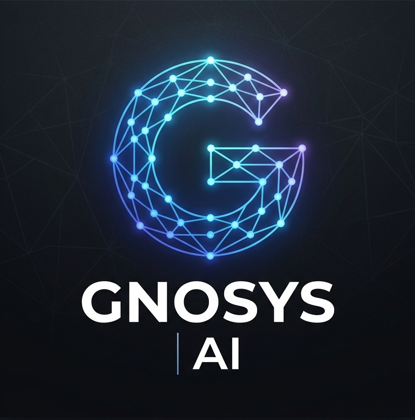
</div>

# Gnosys-AI 🧠 (Universal Study Suite)

[](https://RorriMaesu.github.io/Gnosys-AI/)
[](#)
[](#)
[](#)
[](#)

<a href="https://buymeacoffee.com/rorrimaesu" target="_blank"></a>

**Gnosys-AI** is a premium, AI-powered educational suite designed for students across all disciplines. It accelerates academic mastery through highly gamified spaced-repetition, intelligent scenario decryption, scientific calculations, and an integrated local LLM tutor powered by **Ollama** with configurable model choices.

> [!NOTE]
> **Author's Note & Disclaimer:** I am a student navigating this learning path and developed this application for my personal study. While I am happy to share this tool with other students, please note that it is provided "as-is" with absolutely no guarantees of accuracy. I am using it to learn, and encourage you to always cross-reference definitions with official textbooks.

<p align="center">
  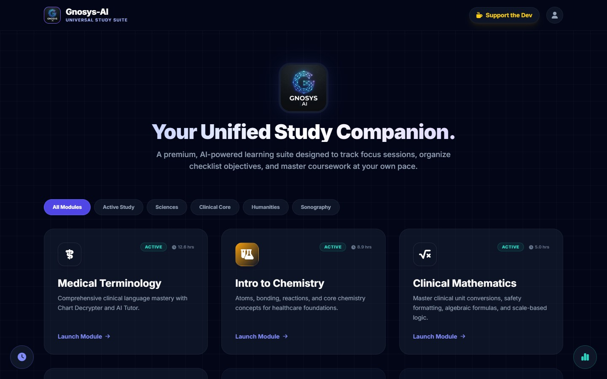
</p>

---

## 🌟 Features

### 1. The Study Hub
A sleek, modern central landing page providing access to the complete curriculum required for academic and professional success. The entire suite features fully integrated **Light and Dark Mode** options with beautiful, frosted-glass navigation and fluid theme switching.

<table width="100%">
  <tr>
    <td width="50%"></td>
    <td width="50%">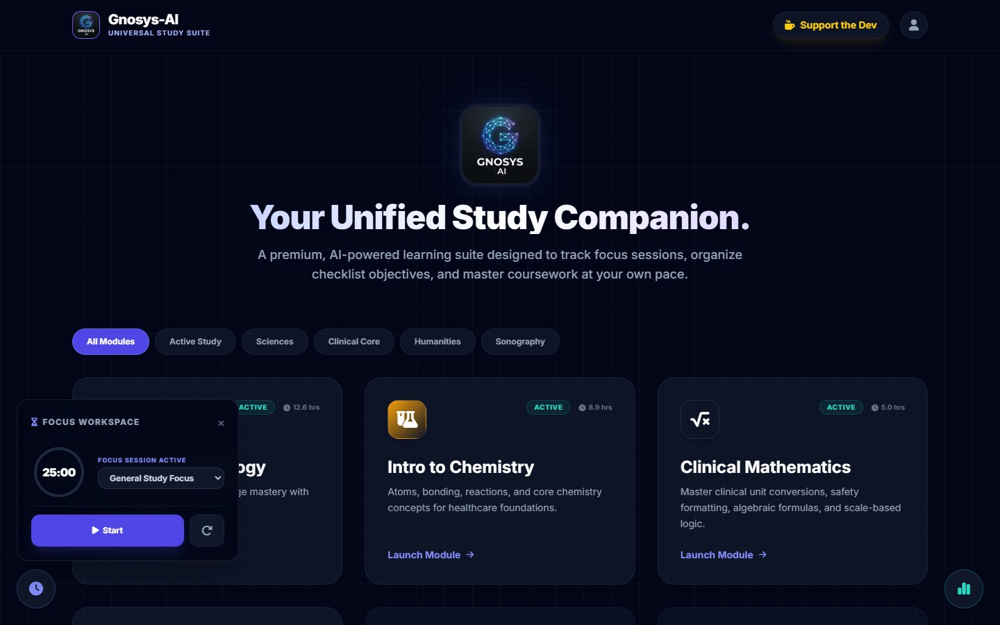</td>
  </tr>
</table>

### 2. Medical Terminology (Active Module)
The foundational module for clinical language mastery.
- **Spaced Repetition Flashcards:** Adaptive algorithm to ensure long-term retention of medical roots, prefixes, and suffixes.
- **Word Builder:** Drag and drop prefixes, roots, and suffixes to construct complex clinical terms.
- **Chart Decrypter:** Translates complex clinical SOAP notes into plain English, intelligently graded by an LLM.
- **Abbreviation Decoder & Pluralization:** Rapid-fire tools to master medical shorthand and grammar.
- **Dr. Lex (AI Tutor):** An integrated, warm, and precise AI tutor powered by **your selected local Ollama model** (including Gemma, Llama, Qwen, Mistral, Phi, or custom tags) that can break down complex terms, provide mnemonics, and generate on-demand quizzes.

<table width="100%">
  <tr>
    <td width="50%"></td>
    <td width="50%"></td>
  </tr>
  <tr>
    <td width="50%"></td>
    <td width="50%"></td>
  </tr>
  <tr>
    <td width="50%"></td>
    <td width="50%"></td>
  </tr>
  <tr>
    <td width="50%">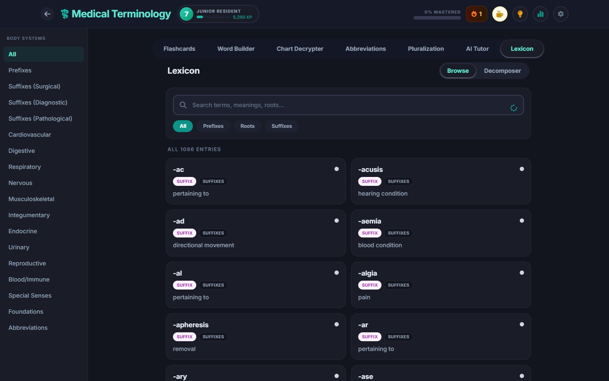</td>
    <td width="50%"></td>
  </tr>
</table>

### 3. Intro to Chemistry (Active Expansion)
A full chemistry learning system spanning Skills Lab, Coursework, and Homework Binder, built for CH 104Z/124Z-style progression.
- **Skills Lab + Crash Course Hub:** Dedicated **Crash Course Chemistry** section with episode playlist navigation, watched tracking, and micro-quiz reinforcement.
- **Core Calculator Stack:** Molar mass, dimensional analysis, stoichiometry, significant figures, nomenclature, and lab-focused precision tools.
- **Prof. Beaker (AI Tutor):** Context-aware chemistry guidance powered by your local Ollama model.

<table width="100%">
  <tr>
    <td width="50%">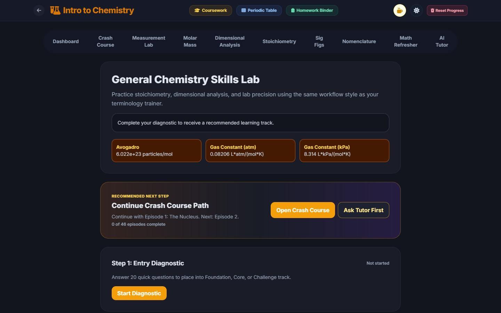</td>
    <td width="50%">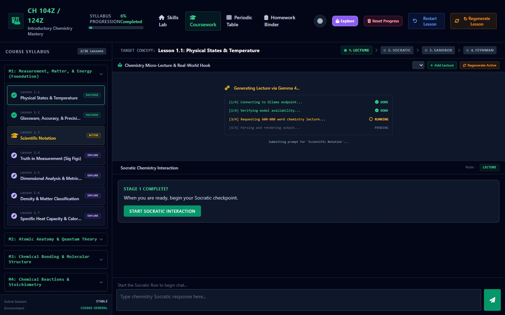</td>
  </tr>
  <tr>
    <td width="50%">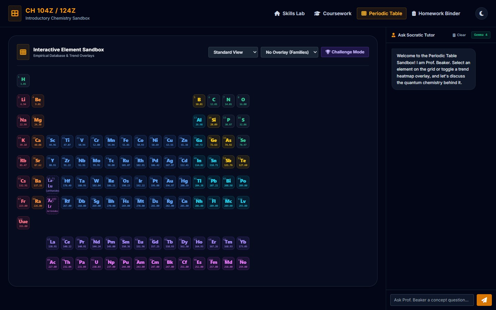</td>
    <td width="50%">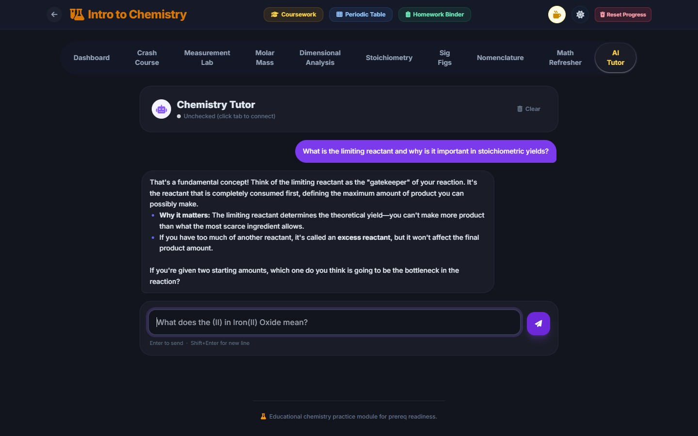</td>
  </tr>
  <tr>
    <td width="50%">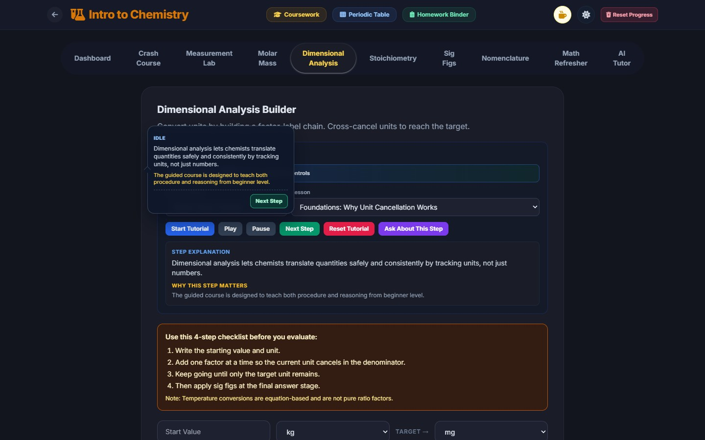</td>
    <td width="50%">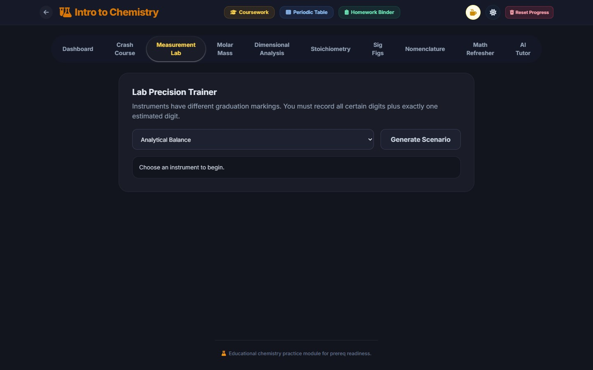</td>
  </tr>
</table>

### 4. Applied Mathematics (Active Module)
A mathematical engine designed to reinforce safety, precision, and accuracy in scientific and clinical calculations.
- **Numeracy & Units:** Practice converting between SI metrics, legacy units, concentrations, and physical measurements.
- **Precision Validator:** Catch and correct formatting errors like trailing zeros (`5.0`), naked decimals (`5.`), and missing leading zeros (`.5`).
- **Algebraic Logic:** Master formula rearrangement with an interactive, foolproof "variable chip" puzzle UI.

<table width="100%">
  <tr>
    <td width="50%">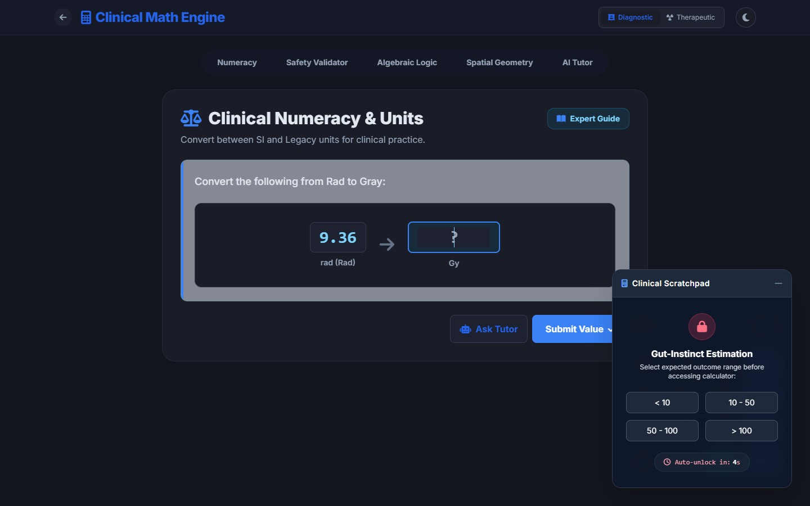</td>
    <td width="50%">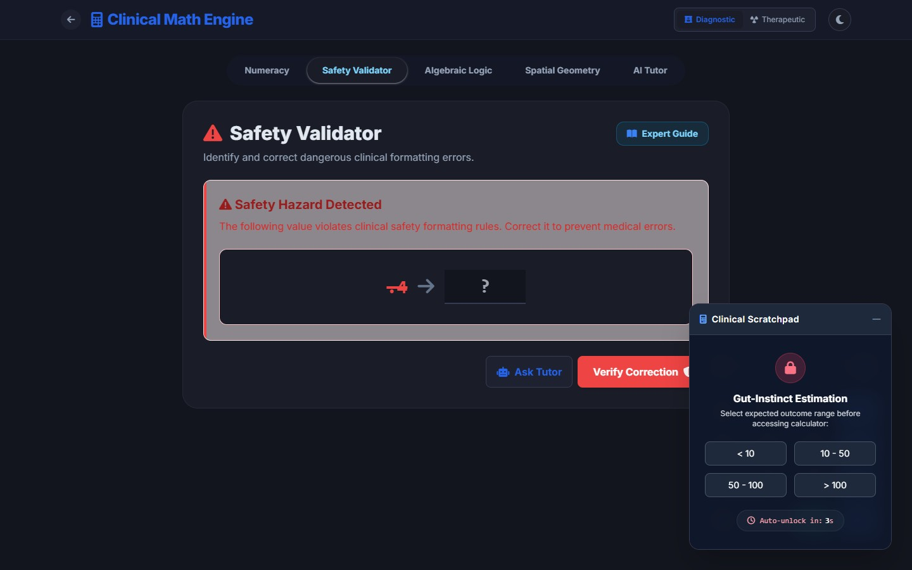</td>
  </tr>
  <tr>
    <td width="50%">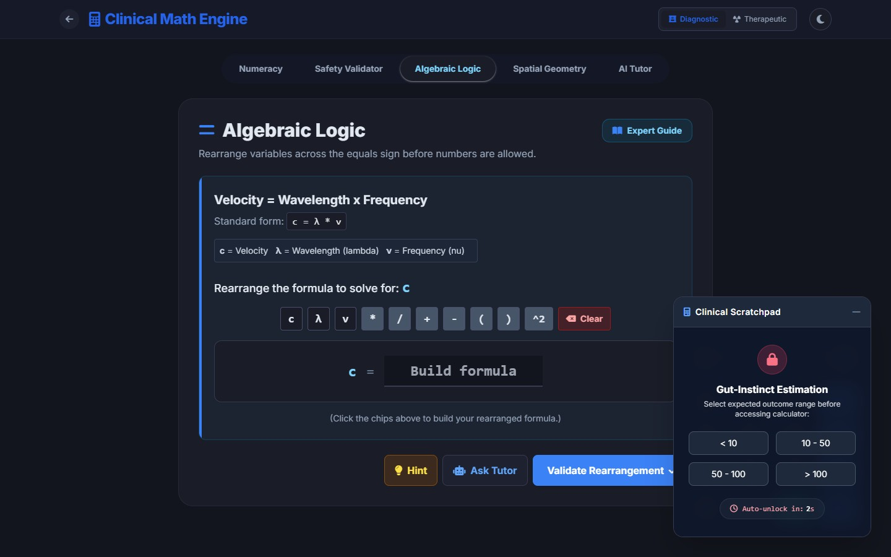</td>
    <td width="50%">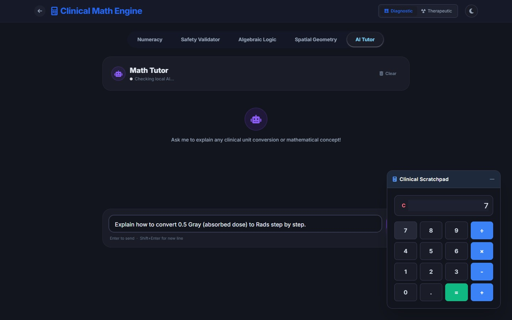</td>
  </tr>
</table>

### 5. Psychology & Communication Simulator (Active Module)
A training module for navigating complex interpersonal, behavioral, and professional care situations.
- **Context Auditor:** Rigorously test your ability to spot hidden behavioral cues, procedural hazards, and safety red flags within complex case charts.
- **Jargon Filter:** Master professional communication by translating academic terminology into comforting, clear explanations.
- **Timed Crisis De-escalation:** A high-stakes gauntlet where you must manage severe interpersonal emergencies using timed tactical empathy.
- **EHR & Documentation Auditor:** Learn the critical difference between subjective reporting and objective, defensible charting.

<table width="100%">
  <tr>
    <td width="50%">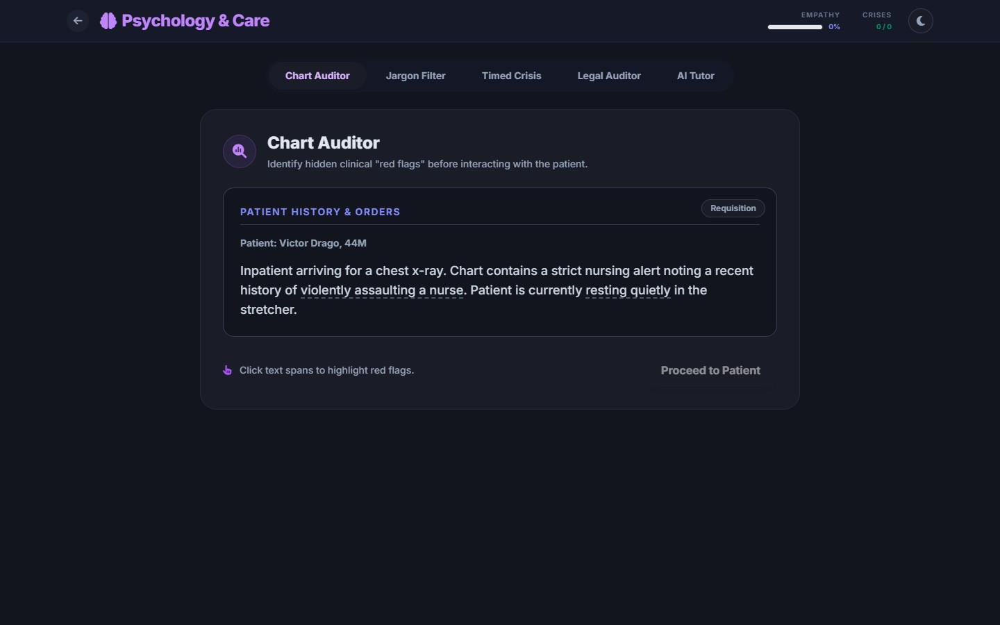</td>
    <td width="50%">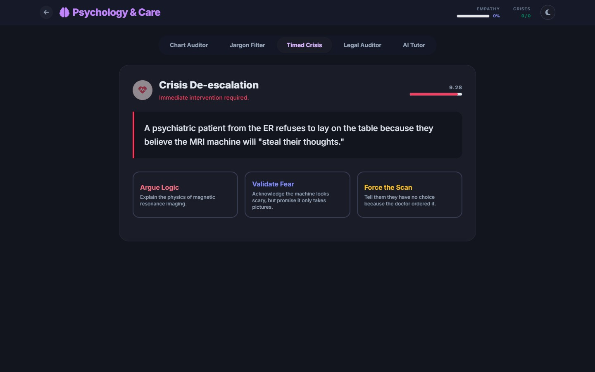</td>
  </tr>
  <tr>
    <td width="50%">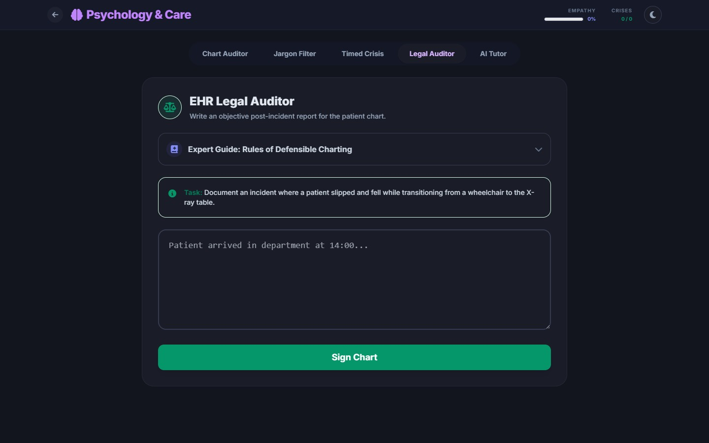</td>
    <td width="50%">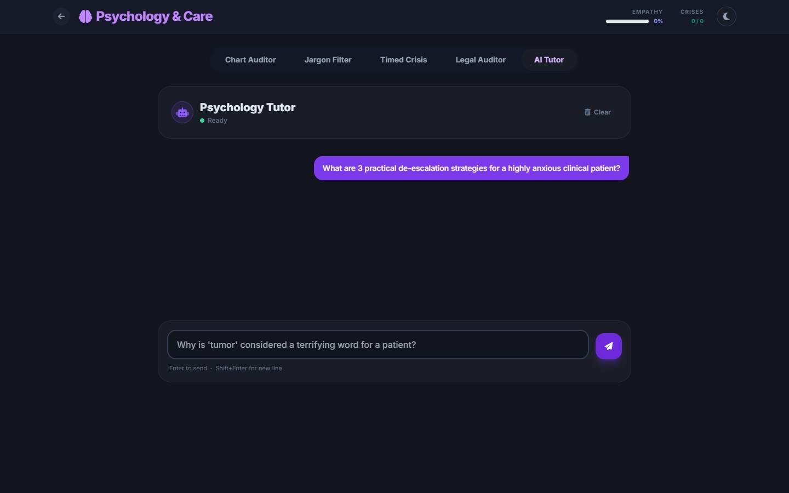</td>
  </tr>
</table>

### 6. Gamification Engine
Learning complex clinical and academic data is hard. Gnosys-AI keeps you engaged and addicted to studying.
- **XP & Leveling System:** Progress from *Pre-Med Student* all the way to *Legacy Master*.
- **Streak Tracking & Shields:** Maintain daily study streaks, unlock achievements, and earn shields to protect progress.
- **Achievement Badges:** Unlock over 20 unique badges.
- **Daily Quests:** Complete objectives for bonus XP.

<table width="100%">
  <tr>
    <td width="50%"></td>
    <td width="50%"></td>
  </tr>
</table>

### 7. Fully Responsive Mobile UI
Study anywhere, perfectly optimized for your phone.

<table width="100%">
  <tr>
    <td width="50%"></td>
    <td width="50%"></td>
  </tr>
</table>

### 8. Intelligent AI Connection Engine & Hardware Profiler
Experience top-tier, private local intelligence with advanced configuration and scheduling tools:
- **Curated High-Quality LLMs:** Select from pre-configured recommended models (`gemma4:e4b`, `llama3.2`, `qwen2.5`, `llama3`, `mistral`, and `phi3`) or supply a custom model tag.
- **Model-Agnostic by Design:** Gnosys-AI is no longer tied to a single primary model. The app supports shared model selection across modules, with automatic fallback to available local models when needed.
- **Hardware-Aware Recommendations:** Automatically query system specifications (GPU adapter, dedicated VRAM, system RAM, Apple Silicon Unified Memory limits) to dynamically recommend optimal models.
- **VRAM Safeguards:** Identifies model memory footprints in GB. Categorizes choices (`✓ Recommended` if fully VRAM accelerated, `⚠️ CPU Offload` if offloaded to slower RAM), and disables options that exceed system thresholds to prevent crashes. One-click "Auto-Configure" automatically selects the best fit for your machine.
- **Dynamic Pull Downloader:** If a chosen model is missing, Gnosys-AI automatically intercepts the state and streams the download directly within the glassmorphic loading modal using Ollama's `/api/pull` streaming endpoint with a real-time progress bar.
- **VRAM Pre-Loading & Connection Caching:** Starts Ollama automatically (via protocol scheme fallback or Python sidecar) and preloads models into warm VRAM. Caches active connection tokens (with 4-minute invalidation checks) to eliminate chat delays.

### 9. Academic & Clinical Curriculum Roadmap
Expanding to support a broad array of subjects across disciplines:
- 🧬 **Natural Sciences**: General Biology, Anatomy & Physiology
- 🧮 **Mathematical & Physical Sciences**: Applied Physics, Wave Mechanics, SPI Physics
- 🏥 **Clinical Specialties**: Ultrasound Physics & Instrumentation, Abdominal Sonography, OB/GYN Sonography, Vascular Sonography, Sectional Anatomy & Pathology
- ✍️ **Humanities & General Studies**: English Composition, Ethics & Communication

---

## 🚀 Getting Started

### Path A: For Students (1-Click Setup)
You do not need to download this repository or know how to code to use Gnosys-AI. The suite is hosted entirely online at **[https://RorriMaesu.github.io/Gnosys-AI/](https://RorriMaesu.github.io/Gnosys-AI/)**.

However, for **Dr. Lex** (the AI Tutor) to work, it runs completely free and privately on your own computer. To activate him:

1. **Install Ollama:** Download and install the Ollama app for [Windows (.exe)](https://ollama.com/download/OllamaSetup.exe) or [macOS (.zip)](https://ollama.com/download/Ollama-darwin.zip).
2. **Download the Smart Launcher:** 
   - **[⬇️ Download Dr. Lex Smart Launcher (.zip)](https://github.com/RorriMaesu/Gnosys-AI/raw/main/assets/Start_Dr_Lex.zip)**
3. **Run the Script:** Open the downloaded `.zip` file and double-click the launcher for your system (`Start_Dr_Lex.bat` for Windows, or `Start_Dr_Lex_Mac.command` for Mac).

The script will configure CORS, detect your hardware profile, download a compatible model, and launch the website for you.

---

### Path B: For Developers (Local Development)
Gnosys-AI is built with pure Vanilla JavaScript and HTML.

1. Clone the repository:
   ```bash
   git clone https://github.com/RorriMaesu/Gnosys-AI.git
   cd Gnosys-AI
   ```
2. Install dependencies and compile CSS:
   ```bash
   npm install
   npm run build:css
   ```
3. Start the custom local HTTP server from the root directory (enables protocol handlers and hardware detection API):
   ```bash
   python server.py
   ```
4. Open your browser and navigate to `http://localhost:8000`.

*Deployment Note:* The project is configured with a GitHub Actions workflow (`deploy.yml`) that automatically deploys the `main` branch to GitHub Pages.

---

## 🛠️ Architecture
- **Frontend:** HTML5, TailwindCSS (via CDN), Vanilla JavaScript.
- **Data Persistence:** Client-side `localStorage`.
- **AI Integration:** Direct asynchronous `fetch` requests to `http://localhost:11434` (Ollama REST API).
- **Icons:** FontAwesome 6.

---

## ☕ Support the Project
Gnosys-AI is a free, open-source educational suite built to help future healthcare heroes. If this app helped you pass your exams or master clinical language, consider buying me a coffee to support continued development and hosting! 

<a href="https://buymeacoffee.com/rorrimaesu" target="_blank"></a>

---

*Built for Academic Excellence.*
